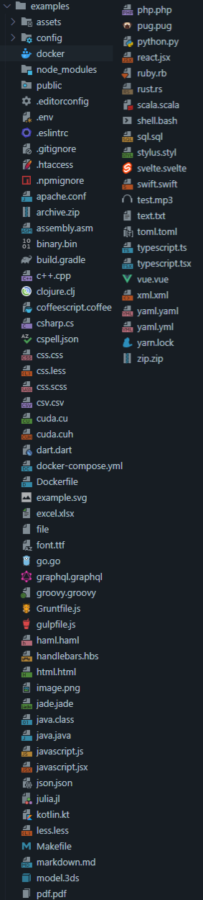

# JetBrains Icons Enhanced for VSCode

**[Get The VSCode Extension](https://marketplace.visualstudio.com/items?itemName=BrennonDenny.vsc-jetbrains-icons-enhanced)**

[Request Icon](https://github.com/brennondenny/vsc-jetbrains-icons-enhanced/issues)

JetBrains Icons Enhanced is a collection of
[JetBrains Icons](https://jetbrains.design/intellij/resources/icons_list/) with
custom edits and additions.

## Icons

---

All JetBrains Icons can be found
[here](https://jetbrains.design/intellij/resources/icons_list/).
